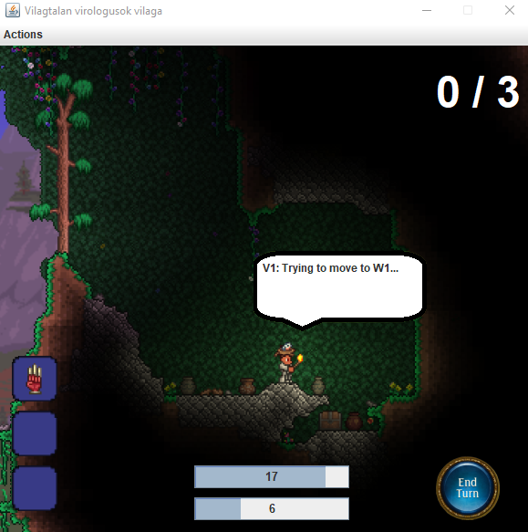
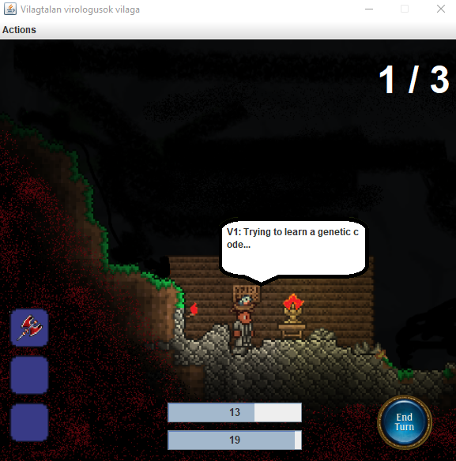

[](https://classroom.github.com/a/coREwzrI)
# Assignment for the [Integration and Verification Techniques](http://www.mit.bme.hu/oktatas/targyak/vimiac04) course at BME MIT.

### Members: 
- Róna Balázs
- Strbik Anna
- Jeges Gábor
- Szabó László

# ORIGINAL PROJECT:

## Assignment for [Software Project Lab](https://www.iit.bme.hu/targyak/BMEVIIIAB02) Course

### Task: Develop and document a complex software product (game) with the waterfall model.

#### Members: 
- Dancsó Marcell
- Róna Balázs
- Bajnok Vencel
- Tóth András
- Pelczhoffer Tamás

#### Documentation:
Undertaken tasks, weekly progression, changes during design can be viewed in documentation.pdf (sadly only in Hungarian)

#### How to use final product:

Navigate to `\FulloschQtyusch`, Open a prompt and run `Qtyusch.jar` with the following command, where <mapName> is the name of the chosen file in the `\FulloschQtyusch\maps` directory.
```
java -jar Qtyusch.jar maps/<mapName>
```

If you want to regenerate the `jar` after a change navigate to `\FulloschQtyusch\src` and run the following two commands:
```
javac -encoding UTF8 Main.java control/*.java model/*java model/agents/*java
model/codes/*java model/equipments/*java model/map/*.java model/strategy/*.java
view/*.java
jar cvfm0 ..\Qtyusch.jar META-INF/MANIFEST.MF *
```
  
### Additional tool: Map Generator
Generates a suitable map for a custom game based on the given inputs.

### Screenshots from the game:
#### Shelter:


#### Warehouse:


#### Infected Laboratory:


