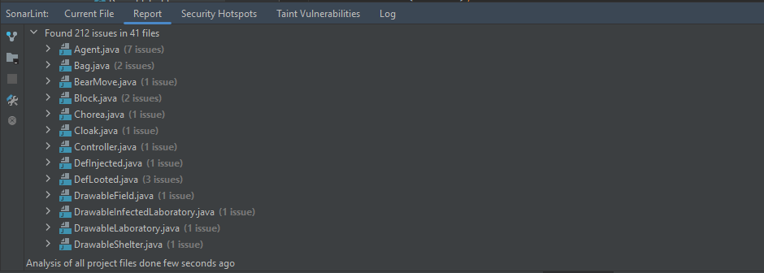

# Statikus Analízis SonarLint-tel

## Eszközök

- IntelliJ
- JDK
- SonarLint

## Analízis

A projektet megnyitjuk IntelliJ-ben, és futtatjuk a SonarLint analízist.

A SonarLint a **Report** fülben felsorolja a projektben talált hibákat.


A hibákról részletes leírást, illetve esetleges megoldási módszereket is kapunk.

A hibákon egyesével, kézzel kell végigmennünk, és ellenőrizni, hogy tényleg érdemes-e
azokkal foglalkozni.

## Meglátások

Számos hibaforrás volt, ami lényegtelen számunkra.

Például, ha egy függvény teste
üresen maradt, akkor a SonarLint extra kódot, vagy egy kommentet vár oda, ami
megindokolja, miért hagytuk a függvényt üresen.

```java
@Override
public void lootedForAminoAcid(Virologist v, Virologist from) {
    // Üres függvény
}
```

Ezen projekt esetében a legtöbb hiba a függvények és változók elnevezési
kovnenciójának megszegéséből származott. Java-ban a szokás az, hogy függvények
kis betűvel kezdődnek, CamelCase-szel íródnak. A projektben szinte az összes
függvény nagy betűvel kezdődött.

```java
void Injected(Virologist v, Agent a); // Rossz!

void injected(Virologist v, Agent a); // Jó!
```

Emellett a hibakezel sokször hiányos vagy túl általános volt, ami azt jelenti,
hogy a `catch` ágak minden hibát elkaptak, de nem csináltak velük semmit.

```java
try {
    // Kód ami hibákat dobhat ...
} catch (Exception e) {
    // Üres catch ág
}
```

Illetve ha mi dobtunk hibát, akkor nem volt saját hibatípusunk, hanem egyszerű
`Exception`-t dobtunk.

```java
throw new Exception("valami hiba"); // Túl általános

throw new LoaderException("valami hiba a loader futása közben"); // Jobb!
```

Voltak olyan hibák is, amik megoldása a kódbázis jelentős módosításával és
átdolgozásával járt volna. Ekkor érdemes átgondolni, hogy a befektetendő energia
arányos-e a probléma súlyosságával. Illetve bizonyos esetekben a javítás sikeres
végrehajtásához szükség lenne a projektet fejlesztő csapat tagjainak a véleményére
és/vagy hozzájárulására is.

```java
public Window(Controller controller, Game game) {
    // ...
    // kb 150 sor kód
    // ...
}
```

## Eredmények

A refaktorált kód jobban megfelel a nyelv konvencióinak, bizonyos esetekben
olvashatóbb, könnyebben értelmezhető és kifejezőbb és biztonságosabb. Ezeknek a
módosításoknak köszönhetően a kódbázis robosztusabb lett, és a jövőben
gördülékenyebben történhet a projekt továbbfejlesztése.
