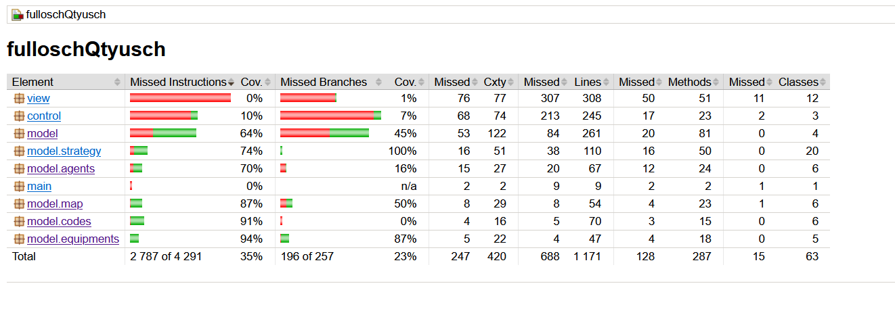

## Megvalósítani tervezett tesztek:

### Model package

- Virologist osztály tesztelése

  - kill
  - attack
  - targetedWith
  - removeEquipment
  - moveToField (Field f)
  - moveToField ()
  - drop
  - lootAminoAcidFrom
  - lootEquipmentFrom
  - collect
  - learn
  - equip
  - addAgent
  - addEquipment <= ezt javítani kellett, mivel akkor is lefutottak a felszerelés változtatásai, ha a virológus nem tudta már felvenni azt
  - getEquipment
  - addGeneticCode
  - inject
  - targetedWith(Agent a)
  - stealAminoAcid
  - stealNukleotid
  - stealEquipment
  - endTurn
  - addAminoAcid
  - addNucleotide
  - removeNucleotide
  - removeAminoAcid

- #### _Agents package_

- Bear osztály tesztelése

  - applyStrategy

- Block osztály tesztelése
  - applyStrategy
  - apply
- Chorea osztály tesztelése

  - apply

- Forget osztály tesztelése
  - apply
- Stun osztály tesztelése

  - applyStrategy

- #### _Codes package_
- BlockCode osztály tesztelése

  - create

- ChoreaCode osztály tesztelése
  - create
- ForgetCode osztály tesztelése

  - create

- StunCode osztály tesztelése

  - create

- #### _Equipments package_
- Axe osztály tesztelése

  - attack
  - applyStrategy

- Bag osztály tesztelése

  - apply
  - disable

- Cloak osztály tesztelése

  - applyStrategy-t a randomsága miatt nem igazán lehet biztosra tesztelni

- Gloves osztály tesztelése

  - applyStrategy
  - injected
  - injectedBy: másik virológus által injected

- #### _Map package_
- Field osztály tesztelése
  -hiba: a szomszédos mezők beállításánál csak egyirányú kapcsolat jön létre,
  ez probléma, mivel a hívónak kell tudnia, hogy a másik mezőn is be kell állítania az asszociációt.
  -javítás: a setField metódus állítsa be a paraméterben kapott field-en is a szomszéd kapcsolatot.
  -Laboratory osztály tesztelése
  -InfectedLaboratory osztály tesztelése
  -Warehouse osztály tesztelése

-megjegyzés: néhány metódust nem lehetett unit teszttel ellenőrizni, mivel azok privát váltózó állapotát változtatják

### Controller package

- Controller osztály tesztelése
  - attack
  - drop
  - inject: itt nem egyértelmű, hogy sikeres-e
  - javítás: az inject exceptiont magasabb szinten kezelni: controller kapja el

### Strategy package
- BearMove osztály tesztelése
  - move
- DefAttack osztály tesztelése
  - attack
- DefCollect osztály tesztelése
  - collect
- DefDrop osztály tesztelése
  - drop
- DefEquip osztály tesztelése
  - equip
- DefInjected osztály tesztelése
  - injected(Virologist v, Agent a)
  - injected(Virologist by, Virologist injected, Agent a)
- DefInject osztály tesztelése
  - inject
- DefLearn osztály tesztelése
  - learn
- DefLoot osztály tesztelése
  - lootAmino
  - lootNucleotide
  - lootEquipment
- DefMove osztály tesztelése
  - move
- NoDrop osztály tesztelése
  - drop

## JaCoCo

